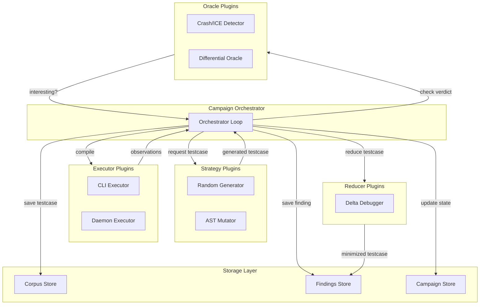

# Kai

Kai is a compiler fuzzer for the Kotlin programming language. Its purpose is to find bugs in the Kotlin compiler by systematically generating test programs, compiling them, and analyzing the results for signs of incorrect behavior.

## Architecture Overview



## How Kai Works

### Campaign Execution Model

Kai executes **campaigns** — automated fuzzing sessions defined by a declarative TOML configuration. A campaign specifies which plugins to use, what budget to apply (time, test case count, or finding limit), and which seed corpus to start from.

The orchestrator runs a sequential loop:

1. **Generation** — A strategy plugin produces a Kotlin test case. Strategies can generate random programs, mutate existing seeds, or apply domain-specific transformations. Multiple strategies can be configured and are scheduled according to a pluggable policy.

2. **Execution** — The test case is compiled using one or more compiler configurations. Each configuration may differ in Kotlin version, language level, or compiler flags. The executor captures exit codes, standard output, standard error, diagnostics, and any produced artifacts.

3. **Judgment** — Oracle plugins examine the observations and return a verdict. An oracle may detect a crash (non-zero exit with stack trace), an internal compiler error (exception thrown inside the compiler), or differential behavior (two compiler configurations produce divergent results on the same input).

4. **Triage** — When an oracle reports an interesting finding, Kai minimizes the test case using reducer plugins, deduplicates it against existing findings using a stable signature, and stores it as a self-contained artifact directory.

### Plugin Architecture

Kai is built around four core plugin interfaces:

| Plugin Type | Responsibility |
|-------------|----------------|
| **Strategy** | Generates or mutates Kotlin test cases given a context value |
| **Executor** | Runs compiler invocations and returns structured observations |
| **Oracle** | Analyzes observations and returns a typed verdict |
| **Reducer** | Minimizes a test case while preserving the finding |

Plugins are discovered at runtime through Java's `ServiceLoader` mechanism. The orchestrator depends only on interfaces, never on concrete implementations. This allows new plugins to be added without modifying or recompiling the core.

### Data Model

All data in Kai is immutable. Test cases, observations, verdicts, and findings are represented as typed value objects. Every test case carries a stable, content-derived ID and full provenance information (which campaign, strategy, and seed produced it). Every finding is stored with complete reproducibility information: the original test case, compiler configuration, observed outputs, and a replay script.

### Storage Layout

Kai stores artifacts under a configurable directory:

- **Corpus** — All generated test cases, queryable by strategy, date, and finding status
- **Findings** — Self-contained directories with sources, observations, replay scripts, and triage notes
- **Campaigns** — Campaign state snapshots for pause/resume and replay

## Running Kai

Build the project:

```bash
./gradlew build
```

Run a campaign:

```bash
./app/kai-cli/build/install/kai-cli/bin/kai-cli run examples/demo.toml
```

The CLI supports additional commands for replaying specific findings and running regression tests against a stored corpus.
